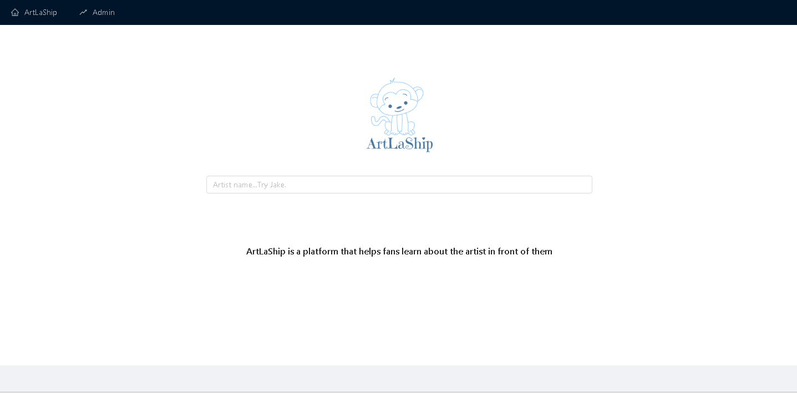
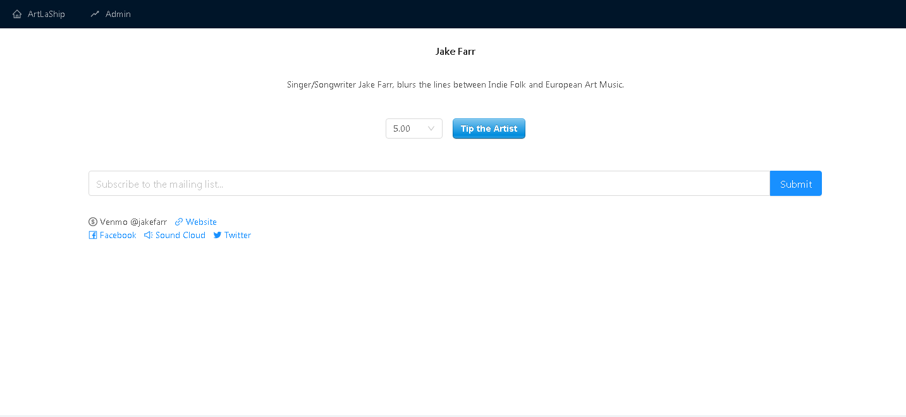
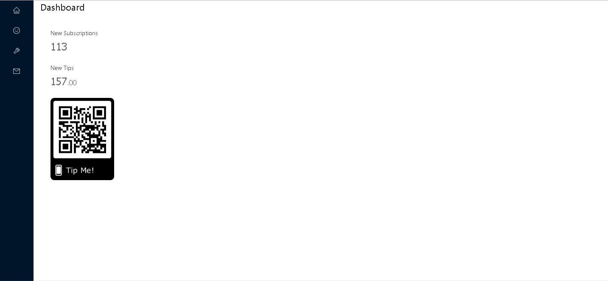
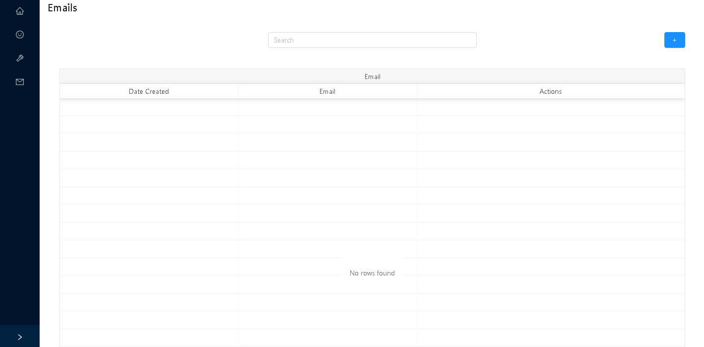
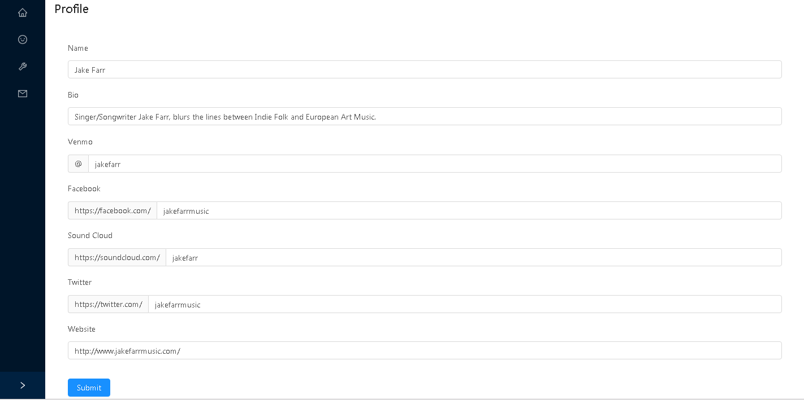

This repo is a project I made for the SXSW 2019 hackathon. It's a way for users to get the info they really care about at live shows or exhibitions. 

Some things it's missing.
1. Registration and login management
2. High quailty search by relevance on the artist search
3. Ability to download the email list by the artist
4. A functional QR code. The current one is just static
5. Ability to edit the artist's bank account details so we can transfer their tips each month
6. A logo and product name that isn't stupid

Users serach for artists by name.

Users can view a artist's bio, tip the band, subscribe to the email list and view links to the artist's websites.

The artist dashboard shows their new subscriptions and new tips and also shows a QR code they can download to print off and stick on gear that redirects users to their profile page.

This page shows their subscriptions.

Let's the artist edit their profile.

